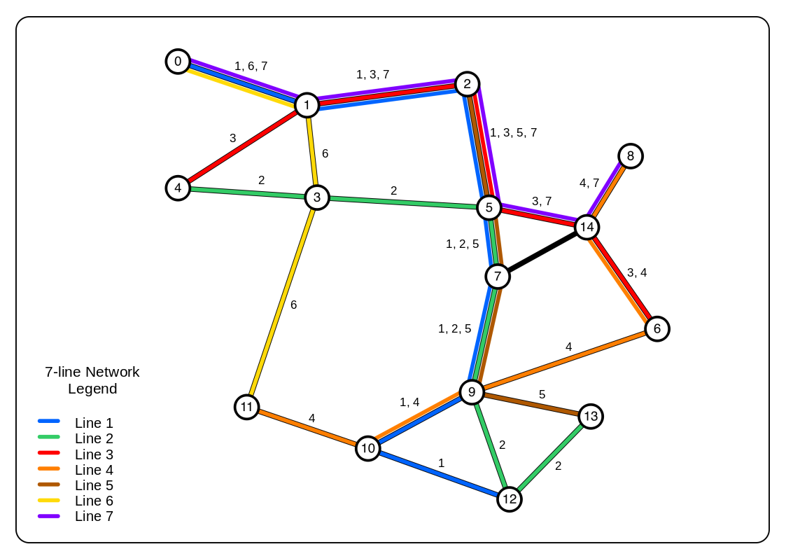

### Ridership and Operations Visualization Engine: An Integrated Transit Performance and Passenger Journey Visualization Engine
#### Caros, N., Guo, X., Stewart, A., Attanucci, J., Nioras, D., Smith, N., Gartsman, A., Zimmer, A. (2022). TRB Annual Meeting, January 11, 2022, Washington, D.C.

* [Paper](https://mobility.mit.edu/publications/2022/caros-ridership-and-operations-visualization-engine-integrated-transit-performance){:target="_blank"}

Transit agencies collect a vast amount of data on vehicle positions, passenger loading and, increasingly, origin-destination flows. Collecting and synthesizing this data to support operations and planning is a significant challenge and can be constrained by information silos within transit agencies. In this paper, an open-source bus performance and journey visualization dashboard, **R**idership and **O**perations **V**isualization **E**ngine (ROVE), is presented that integrates multiple disparate data sources into a flexible and iterative analysis tool. It differs from existing commercial products by including origin-destination flows along with standard performance metrics, and is designed to be adaptable and relevant to any transit agency. Two case studies are presented to demonstrate the functionality of the dashboard: planning transit priority infrastructure and evaluating network design changes. The dashboard was developed in partnership with Chicago Transit Authority and Massachusetts Bay Transportation Authority, and practical details from the installation and maintenance procedures are included for prospective users.

---

### Effects of Bus Stop Spacing in Public Transportation Performance: An Analysis of Parallel Corridors in Chicago
#### Nioras, D. (2019). Transport Chicago Conference, June 14, 2019, Chicago, IL.

* [Paper](../assets/documents/research-projects/StopSpacing_Study_DimitrisNioras.pdf){:target="_blank"}
* [Presentation](../assets/documents/research-projects/StopSpacing_Study_DimitrisNioras_ppt.pdf){:target="_blank"}

Bus stop spacing is a crucial element in providing a balance between efficiency and coverage in a public transportation network. Having large distances between subsequent stops ensures shorter travel times and higher reliability, mainly because the total dwell time is short and the possibility of potential delays and bus bunching is low. On the other hand, having small distances ensures good area coverage and access, given that the service area of a stop is defined by a walking distance threshold. Achieving a balance between efficiency and coverage can boost ridership, but is a challenge that requires the consideration of many factors, including accessibility and performance policies.

In the city of Chicago, the average stop spacing policy is 0.125 miles, or 8 stops per mile. This distance provides reasonable access to bus stops, but at the same time creates issues with high travel times and, in corridors with frequent service, bus bunching. CTA has been studying the possibility of increasing stop spacing; on Ashland Avenue, half of the stops were eliminated for route 9, while at the same time the express route X9 skips stops along the corridor. Chicago is a great candidate for a study of the effects of bus stop spacing in route travel time and ridership, because of the grid network and the variety in stop spacing along routes.

The study focuses on parallel corridors, including Halsted, Ashland, Damen and Western. A review is also be conducted on stop spacing patterns and coverage potential to complement the initial analysis.

---

### Feasibility of the Transition to a Battery Electric Fleet in Public Transit
#### Nioras, D. (2019). Transport Chicago Conference, June 14, 2019, Chicago, IL.

* [Paper](../assets/documents/research-projects/BEB_Feasibility_Study_DimitrisNioras.pdf){:target="_blank"}
* [Presentation](../assets/documents/research-projects/BEB_Feasibility_Study_DimitrisNioras_ppt.pdf){:target="_blank"}

Public transportation systems nowadays struggle to cover their operation and maintenance expenses in an environment of continuously decreasing ridership. Fare revenue covers no more than 50% of the total operation costs, while funding from federal and state governments is incapable of closing the gap of revenues and expenses. These funding issues cause difficulties in maintaining current assets, so it is even more difficult to fund improvements to the system, replacement of vehicles that have exceeded their useful life and building renovations.

The limited funding created the need to include transportation asset management in public transit. The Federal Transit Administration (FTA) provides frameworks and software packages (Transit Economic Requirements Model, TERM) to make asset management accessible to transit agencies. In fact, FTA requires all agencies to create Asset Management plans, in order to be eligible for federal funding towards State of Good Repair improvements.

This project aims at researching the vehicle replacement problem while taking advantage of the available new technologies in electric mobility. The project examines a variety of replacement alternatives, including the transition to a full battery electric bus fleet by the end of the study period. The analysis is made on the Chicago Transit Authority’s bus fleet; only vehicle-related costs are considered and investments in charging facilities are not included.

---

### Urban Transit Network Design with Distinct Passenger Groups: Model and Application
#### Nioras, D., Iliopoulou, C., Kepaptsoglou, K., Li, Z. (2019). TRB Annual Meeting, January 15, 2020, Washington, D.C.

* [Poster](../assets/documents/research-projects/UTRP_DimitrisNioras_Poster_TRB.pdf){:target="_blank"}

The design of public transportation networks usually focuses on maximizing total welfare, under resource and operation constraints and the assumption of average trip characteristics for a typical user. Nevertheless, there exist different passenger groups (such as current and choice travelers), whose needs may vary and should be prioritized in the planning stage. This paper proposes a model for designing a public transportation network, which considers the needs of different passenger groups. A mathematical programming model is formulated for that purpose and solved using a hybridized Genetic Algorithm based procedure. An application of the model for Mandl’s benchmark network is presented and results show that prioritizing captive users may be achieved with minimum impact to the service quality of the public transportation network.